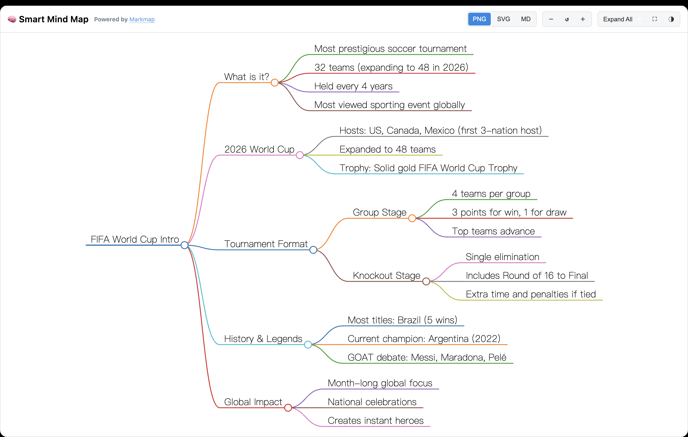

# OpenWebUI Extensions
<!-- ALL-CONTRIBUTORS-BADGE:START - Do not remove or modify this section -->

<!-- ALL-CONTRIBUTORS-BADGE:END -->

English | [中文](./README_CN.md)

A collection of enhancements, plugins, and prompts for [open-webui](https://github.com/open-webui/open-webui), developed and curated for personal use to extend functionality and improve experience.

<!-- STATS_START -->
## 📊 Community Stats
>
> 

| 👤 Author | 👥 Followers | ⭐ Points | 🧩 Plugin Contributions |
| :---: | :---: | :---: | :---: |
| [Fu-Jie](https://openwebui.com/u/Fu-Jie) |  |  |  |

| 📝 Posts | ⬇️ Plugin Downloads | 👁️ Plugin Views | 👍 Upvotes | 💾 Plugin Saves |
| :---: | :---: | :---: | :---: | :---: |
|  |  |  |  |  |

### 🔥 Top 6 Popular Plugins

| Rank | Plugin | Version | Downloads | Views | 📅 Updated |
| :---: | :--- | :---: | :---: | :---: | :---: |
| 🥇 | [Smart Mind Map](https://openwebui.com/posts/turn_any_text_into_beautiful_mind_maps_3094c59a) |  |  |  |  |
| 🥈 | [Smart Infographic](https://openwebui.com/posts/smart_infographic_ad6f0c7f) |  |  |  |  |
| 🥉 | [Markdown Normalizer](https://openwebui.com/posts/markdown_normalizer_baaa8732) |  |  |  |  |
| 4️⃣ | [Async Context Compression](https://openwebui.com/posts/async_context_compression_b1655bc8) |  |  |  |  |
| 5️⃣ | [Export to Word Enhanced](https://openwebui.com/posts/export_to_word_enhanced_formatting_fca6a315) |  |  |  |  |
| 6️⃣ | [AI Task Instruction Generator](https://openwebui.com/posts/ai_task_instruction_generator_9bab8b37) |  |  |  |  |

### 📈 Total Downloads Trend

*See full stats and charts in [Community Stats Report](./docs/community-stats.md)*
<!-- STATS_END -->

## 🌟 Star Features

### 1. [GitHub Copilot Official SDK Pipe](https://openwebui.com/posts/github_copilot_official_sdk_pipe_ce96f7b4)    

**The ultimate autonomous Agent integration for OpenWebUI.** Deeply bridging GitHub Copilot SDK with your OpenWebUI ecosystem. It enables the Agent to autonomously perform **intent recognition**, **web search**, and **context compaction** while reusing your existing tools, skills, and configurations for a professional, full-featured experience.

> [!TIP]
> **No GitHub Copilot subscription required!** Supports **BYOK (Bring Your Own Key)** mode using your own OpenAI/Anthropic API keys.

#### 🚀 Key Leap (v0.12.3)

- **� SDK & CLI Upgrade**: Migrated from `github-copilot-sdk` v0.1.30 to **v0.2.2**, with full compatibility for the new dataclass-based API and positional `send()` arguments.
- **🗂️ Model Filtering & Sorting**: Added provider-aware sorting (OpenAI → Anthropic → others) and exact-prefix model filtering to remove legacy/sunset models cleanly.
- **�🛡️ Disable Terminal Tools for AI**: Terminal server tools are now filtered out at the pipe level, preventing AI from calling them while keeping terminal functionality available to users.
- **🎨 RichUI Theme-Aware CSS Variables**: Added CSS custom properties that automatically adapt to light/dark themes for better text contrast.
- **📊 Interactive Delivery**: Full support for **HTML Artifacts** and **RichUI** rendering, providing instant interactive previews and persistent downloadable results.
- **🛠️ Deterministic Toolchain**: Built-in specialized tools for skill lifecycles (`manage_skills`) and system optimization.

> [!TIP]
> **💡 Pro Tip: Enhanced Visualization**
> We highly recommend asking the Agent to install the [Visual Explainer](https://github.com/nicobailon/visual-explainer) skill during your conversation. It dramatically improves the aesthetics and interactivity of generated **HTML Artifacts**. Simply tell the AI:
> "Please install this skill: <https://github.com/nicobailon/visual-explainer>" to get started.

#### 📺 Demo: Visual Skills & Data Analysis

> *In this demo, the Agent installs a visual enhancement skill and automatically generates an interactive dashboard from World Cup data.*

> *Combined with the Excel Expert skill, the Agent can automate complex data cleaning, multi-dimensional statistics, and generate professional data dashboards.*

#### 🌟 Featured Real-World Cases

- **[GitHub Star Forecasting](./docs/plugins/pipes/star-prediction-example.md)**: Automatically parsing CSV data, writing analysis scripts, and generating interactive growth dashboards.
- **[Video Optimization](./docs/plugins/pipes/video-processing-example.md)**: Direct control of system-level tools (FFmpeg) to accelerate and compress media with professional color optimization.

### 2. [Smart Mind Map](https://openwebui.com/posts/turn_any_text_into_beautiful_mind_maps_3094c59a)

**Experience interactive thinking.** Seamlessly transforms complex chat sessions into structured, clickable mind maps for better visual modeling and rapid idea extraction.

### 3. [Smart Infographic](https://openwebui.com/posts/smart_infographic_ad6f0c7f)

**Professional data storytelling.** Converts raw information into sleek, boardroom-ready infographics powered by AntV, perfect for summarizing long-form content instantly.

### 4. [Export to Word Enhanced](https://openwebui.com/posts/export_to_word_enhanced_formatting_fca6a315)

**High-fidelity reporting.** Export conversation history into professionally formatted Word documents with preserved headers, code blocks, and math formulas.

### 5. [Async Context Compression](https://openwebui.com/posts/async_context_compression_b1655bc8)

**Maximize your context window.** Intelligently compresses chat history using LLM logic to save tokens and costs while maintaining a high-quality reasoning chain.

### 6. [Batch Install Plugins from GitHub](https://openwebui.com/posts/batch_install_plugins_install_popular_plugins_in_s_c9fd6e80) 

**Faster plugin onboarding across community repositories.** Pull plugins from multiple GitHub repositories in one request, then narrow the result set inside an interactive dialog with repository tags, type filters, keyword search, and descriptions before installing only the subset you want.

> *A single install dialog can merge multiple repositories and let you filter visually before anything is installed.*

## 📦 Project Contents

<!-- markdownlint-disable MD033 -->

<b>🧩 Plugins (Actions, Filters, Pipes, Pipelines)</b>

Located in the `plugins/` directory, containing Python-based enhancements:

### Actions

- **Smart Mind Map** (`smart-mind-map`): Generates interactive mind maps from text.
- **Smart Infographic** (`infographic`): Transforms text into professional infographics using AntV.
- **Flash Card** (`flash-card`): Quickly generates beautiful flashcards for learning.
- **Deep Dive** (`deep-dive`): A comprehensive thinking lens that dives deep into any content.
- **Export to Excel** (`export_to_excel`): Exports chat history to Excel files.
- **Export to Word** (`export_to_docx`): Exports chat history to Word documents.

### Tools

- **Smart Mind Map Tool** (`smart-mind-map-tool`): The tool version of Smart Mind Map, enabling AI proactive/autonomous invocation.
- **OpenWebUI Skills Manager Tool** (`openwebui-skills-manager-tool`): Native tool for managing OpenWebUI skills.
- **Batch Install Plugins from GitHub** (`batch-install-plugins`): Discovers plugins from multiple GitHub repositories and installs them through an interactive repository/type-filtered selection dialog.

### Filters

- **GitHub Copilot SDK Files Filter** (`github_copilot_sdk_files_filter`): Essential companion for Copilot SDK. Bypasses RAG to ensure full file accessibility for Agents.
- **Web Gemini Multimodal Filter** (`web_gemini_multimodel_filter`): Adds multimodal capabilities (PDF, Video, Office) to any model with intelligent routing.
- **Async Context Compression** (`async-context-compression`): Optimizes token usage via context compression.
- **Context Enhancement** (`context_enhancement_filter`): Enhances chat context.
- **Folder Memory** (`folder-memory`): Automatically extracts project rules from conversations and injects them into the folder's system prompt.
- **Markdown Normalizer** (`markdown_normalizer`): Fixes common Markdown formatting issues in LLM outputs.

### Pipes

- **GitHub Copilot SDK** (`github-copilot-sdk`): Official GitHub Copilot SDK integration (v0.12.3). Supports dynamic models (GPT-4o, Claude 3.7, o1), multi-turn conversation, and high-performance process pooling.

### Pipelines

- **Wisdom Synthesizer** (`wisdom_synthesizer`): An external pipeline filter that refactors aggregate requests with collective wisdom to output structured expert reports.

<!-- markdownlint-enable MD033 -->

<!-- markdownlint-disable MD033 -->

<b>🎯 Prompts (System Prompts for various roles)</b>

System Prompts are managed in the `docs/prompts/` directory:

- **[Prompt Library](./docs/prompts/library.md)**: A curated collection of fine-tuned prompts for Coding, Marketing, and Analysis.

<!-- markdownlint-enable MD033 -->

## 🛠️ Extensions

Standalone frontend extensions to supercharge your Open WebUI:

- **[Open WebUI Prompt Plus](https://github.com/Fu-Jie/open-webui-prompt-plus)**

: An all-in-one prompt management suite featuring AI-powered prompt generation, spotlight-style quick search, and advanced category organization.

## 📖 Documentation

Located in the `docs/en/` directory:

- **[Plugin Development Guide](./docs/en/plugin_development_guide.md)** - The authoritative guide covering everything from getting started to advanced patterns and best practices. ⭐

For code examples, please check the `docs/examples/` directory.

## 🚀 Quick Start

This project is a collection of resources and does not require a Python environment. Simply download the files you need and import them into your OpenWebUI instance.

### Using Plugins

1. **Install from OpenWebUI Community (Recommended)**:
   - Visit my profile: [Fu-Jie's Profile](https://openwebui.com/u/Fu-Jie)
   - Browse the plugins and select the one you like.
   - Click "Get" to import it directly into your OpenWebUI instance.

2. **Quick Install All Plugins**: To install all plugins to your local OpenWebUI instance at once, clone this repo and run `python scripts/install_all_plugins.py` after configuring your API key in `.env` — see [Deployment Guide](./scripts/DEPLOYMENT_GUIDE.md) for details.

### Using Prompts

1. Browse the `/prompts` directory and select a prompt file (`.md`).
2. Copy the file content.
3. In the OpenWebUI chat interface, click the "Prompt" button above the input box.
4. Paste the content and save.

### Contributing

If you have great prompts or plugins to share:

1. Fork this repository.
2. Add your files to the appropriate `prompts/` or `plugins/` directory.
3. Submit a Pull Request.

[Contributing](./CONTRIBUTING.md)

## Contributors ✨

Thanks goes to these wonderful people ([emoji key](https://allcontributors.org/docs/en/emoji-key)):

<!-- ALL-CONTRIBUTORS-LIST:START - Do not remove or modify this section -->
<!-- prettier-ignore-start -->
<!-- markdownlint-disable -->
<table>
  <tbody>
    <tr>
      <td align="center" valign="top" width="14.28%"><a href="https://github.com/rbb-dev"> <b>rbb-dev</b></a> <a href="#ideas-rbb-dev" title="Ideas, Planning, & Feedback">🤔</a> <a href="https://github.com/Fu-Jie/openwebui-extensions/commits?author=rbb-dev" title="Code">💻</a></td>
      <td align="center" valign="top" width="14.28%"><a href="https://trade.xyz/?ref=BZ1RJRXWO"> <b>Raxxoor</b></a> <a href="https://github.com/Fu-Jie/openwebui-extensions/issues?q=author%3Adhaern" title="Bug reports">🐛</a> <a href="#ideas-dhaern" title="Ideas, Planning, & Feedback">🤔</a></td>
      <td align="center" valign="top" width="14.28%"><a href="https://github.com/i-iooi-i"> <b>ZOLO</b></a> <a href="https://github.com/Fu-Jie/openwebui-extensions/issues?q=author%3Ai-iooi-i" title="Bug reports">🐛</a> <a href="#ideas-i-iooi-i" title="Ideas, Planning, & Feedback">🤔</a></td>
      <td align="center" valign="top" width="14.28%"><a href="https://perso.crans.org/grande/"> <b>Johan Grande</b></a> <a href="#ideas-nahoj" title="Ideas, Planning, & Feedback">🤔</a></td>
      <td align="center" valign="top" width="14.28%"><a href="https://github.com/abaroni"> <b>Alessandro Baroni</b></a> <a href="#ideas-abaroni" title="Ideas, Planning, & Feedback">🤔</a></td>
    </tr>
  </tbody>
</table>

<!-- markdownlint-restore -->
<!-- prettier-ignore-end -->

<!-- ALL-CONTRIBUTORS-LIST:END -->

This project follows the [all-contributors](https://github.com/all-contributors/all-contributors) specification. Contributions of any kind welcome!
