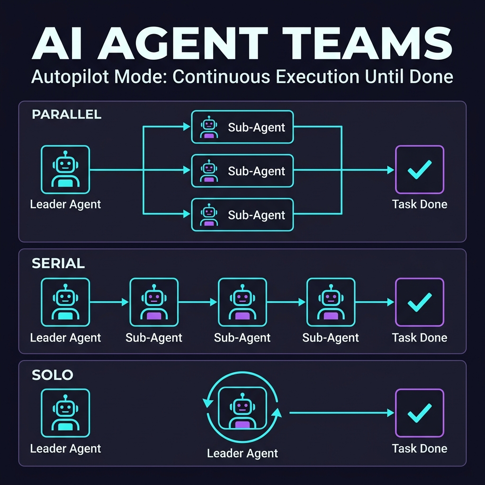

# OpenWebUI Extensions

[English](./README.md) | 中文

OpenWebUI 增强功能集合。包含个人开发与收集的插件、提示词等资源。

<!-- STATS_START -->
## 📊 社区统计
> 

| 👤 作者 | 👥 粉丝 | ⭐ 积分 | 🧩 插件贡献 |
| :---: | :---: | :---: | :---: |
| [Fu-Jie](https://openwebui.com/u/Fu-Jie) |  |  |  |

| 📝 发布 | ⬇️ 插件下载 | 👁️ 插件浏览 | 👍 点赞 | 💾 插件收藏 |
| :---: | :---: | :---: | :---: | :---: |
|  |  |  |  |  |

### 🔥 热门插件 Top 6
| 排名 | 插件 | 版本 | 下载 | 浏览 | 📅 更新 |
| :---: | :--- | :---: | :---: | :---: | :---: |
| 🥇 | [Smart Mind Map](https://openwebui.com/posts/turn_any_text_into_beautiful_mind_maps_3094c59a) |  |  |  |  |
| 🥈 | [Async Context Compression](https://openwebui.com/posts/async_context_compression_b1655bc8) |  |  |  |  |
| 🥉 | [Smart Infographic](https://openwebui.com/posts/smart_infographic_ad6f0c7f) |  |  |  |  |
| 4️⃣ | [Markdown Normalizer](https://openwebui.com/posts/markdown_normalizer_baaa8732) |  |  |  |  |
| 5️⃣ | [OpenWebUI Skills Manager Tool](https://openwebui.com/posts/openwebui_skills_manager_tool_b4bce8e4) |  |  |  |  |
| 6️⃣ | [AI Task Instruction Generator](https://openwebui.com/posts/ai_task_instruction_generator_9bab8b37) |  |  |  |  |

### 📈 总下载量累计趋势

*完整统计与趋势图请查看 [社区统计报告](./docs/community-stats.zh.md)*
<!-- STATS_END -->

## 🌟 精选功能

### 1. [GitHub Copilot Official SDK Pipe](https://openwebui.com/posts/github_copilot_official_sdk_pipe_ce96f7b4)  

**OpenWebUI 终极自主 Agent 深度集成。** 将 GitHub Copilot SDK 与 OpenWebUI 生态完美桥接。它允许 Agent 具备**智能意图识别**、**自主网页搜索**与**自动上下文压缩**能力，同时直接复用您现有的工具、技能与配置，通过全功能 Skill 体系带来极致的专业交互体验。

> [!TIP]
> **无需 GitHub Copilot 订阅！** 支持 **BYOK (Bring Your Own Key)** 模式，使用你自己的 OpenAI/Anthropic API Key。

#### 🚀 核心进化 (v0.13.1)

- **🔌 OpenWebUI 0.9.x 双兼容**（关键）：所有 OpenWebUI 模型/配置/工具 API 现已透明支持同步（0.9 以下）和异步（0.9.x）双接口，无需版本分支判断，插件自动适配。
- **🚀 内部方法升级为 async**：`_read_tool_server_connections`、`_build_openwebui_request` 和 `_parse_mcp_servers` 已升级为 `async def`，消除了在 0.9.x 异步方法下会崩溃的线程托底模式。
- **🛡️ 同步安全的选项提供器**：`Valves` 和 `UserValves` 选项提供器（同步 classmethod）现使用兼容封装，使 `search_models` 调用在同步和异步上下文中均安全。
- **🐛 文件发布路径修复**：`publish_file_from_workspace` 现使用类型安全的兼容层替代原始 `asyncio.to_thread`，解决了 Files 方法在 0.9.x 变为协程后的静默崩溃问题。

> *Agent Team 架构支持自主任务调度，具备并行、串行及单兵执行模式，由持久化的 Autopilot 驱动直到任务完成。*

> [!TIP]
> **💡 进阶实战建议**
> 强烈推荐在对话中让 Agent 为其安装 [Visual Explainer](https://github.com/nicobailon/visual-explainer) 技能。该技能能显著提升 **HTML Artifacts** 的美观度与交互深度，只需对 AI 说：
> “请帮我安装这个技能：<https://github.com/nicobailon/visual-explainer”> 即可瞬间启用。

#### 📺 演示：可视化技能与数据分析

> *在此演示中，Agent 自动安装可视化增强技能，并根据世界杯表格数据瞬间生成交互式看板。*

> *结合 Excel 专家技能，Agent 可以自动化执行复杂的数据清洗、多维度统计并生成专业的数据看板。*

#### 🌟 核心实战案例

- **[GitHub Star 增长预测](./docs/plugins/pipes/star-prediction-example.zh.md)**：自动解析 CSV 数据，编写 Python 分析脚本并生成动态增长看板。
- **[视频高质量转换与压缩](./docs/plugins/pipes/video-processing-example.zh.md)**：直接调用系统级 FFmpeg 工具，实现录屏的加速、缩放及双阶段色彩优化。

### 2. [Smart Mind Map](https://openwebui.com/posts/turn_any_text_into_beautiful_mind_maps_3094c59a) 

**体验浸入式思维。** 将复杂的对话瞬间转化为结构化、可点击的交互式思维导图，助力知识建模与逻辑提取。

### 3. [Smart Infographic](https://openwebui.com/posts/smart_infographic_ad6f0c7f) 

**专业数据叙事。** 将零散信息转化为精美的信息图表（由 AntV 驱动），一键生成学术/汇报级的可视化总结。

### 4. [Export to Word Enhanced](https://openwebui.com/posts/export_to_word_enhanced_formatting_fca6a315) 

**高保真文档导出。** 将对话历史导出为格式完美的 Word 文档，完美保留标题、代码块、LaTeX 公式及 Mermaid 流程图。

### 5. [Async Context Compression](https://openwebui.com/posts/async_context_compression_b1655bc8) 

**挑战 Token 極限。** 采用多专家异步压缩逻辑，在保持高吞吐量推理链的同时，大幅降低 Token 消耗。

### 6. [Batch Install Plugins from GitHub](https://openwebui.com/posts/batch_install_plugins_install_popular_plugins_in_s_c9fd6e80) 

**更快试用多个社区插件仓库。** 一次请求即可聚合多个 GitHub 仓库里的插件，再通过交互式对话框里的仓库标签、类型筛选、关键词搜索和描述信息，把要安装的范围缩小到真正需要的子集。

> *一个安装对话框就能合并多个仓库，并在真正安装前先完成可视化筛选。*

## 📦 项目内容

<!-- markdownlint-disable MD033 -->

<b>🧩 插件 (Actions, Filters, Pipes, Pipelines)</b>

位于 `plugins/` 目录，包含各类 Python 编写的功能增强插件：

### Actions (交互增强)

- **Smart Mind Map** (`smart-mind-map`): 智能分析文本并生成交互式思维导图。
- **Smart Infographic** (`infographic`): 基于 AntV 的智能信息图生成工具。
- **Flash Card** (`flash-card`): 快速生成精美的学习记忆卡片。
- **Deep Dive** (`deep-dive`): 深度思考透镜，从背景、逻辑、洞察到行动路径的全方位分析。
- **Export to Excel** (`export_to_excel`): 将对话内容导出为 Excel 文件。
- **Export to Word** (`export_to_docx`): 将对话内容导出为 Word 文档。

### Tools (工具)

- **智能思维导图工具** (`smart-mind-map-tool`): 思维导图的 Tool 版本，支持 AI 主动/自主调用。
- **OpenWebUI Skills 管理工具** (`openwebui-skills-manager-tool`): 用于管理 OpenWebUI Skills 的原生工具。
- **Batch Install Plugins from GitHub** (`batch-install-plugins`): 从多个 GitHub 仓库发现插件，并通过支持仓库/类型筛选的交互式选择对话框完成安装。

### Filters (消息处理)

- **GitHub Copilot SDK Files Filter** (`github_copilot_sdk_files_filter`): Copilot SDK 必备搭档。绕过 RAG，确保 Agent 能真正看到你的每一个文件。
- **Web Gemini Multimodal Filter** (`web_gemini_multimodel_filter`): 为任意模型提供多模态能力（PDF、Office、视频等），支持智能路由。
- **Async Context Compression** (`async-context-compression`): 异步上下文压缩，优化 Token 使用。
- **Context Enhancement** (`context_enhancement_filter`): 上下文增强过滤器。
- **Folder Memory** (`folder-memory`): 自动从对话中提取项目规则并注入到文件夹系统提示词中。
- **Markdown Normalizer** (`markdown_normalizer`): 修复 LLM 输出中常见的 Markdown 格式问题。

### Pipes (模型管道)

- **GitHub Copilot SDK** (`github-copilot-sdk`): 深度集成 GitHub Copilot SDK 的强大 Agent (v0.13.2)。支持 OpenWebUI 0.9.x 全面兼容、BYOK 模型优先级、纯 BYOK 模式、智能意图识别、自主网页搜索与上下文压缩。

### Pipelines (工作流管道)

- **Wisdom Synthesizer** (`wisdom_synthesizer`): 智能拦截并重塑多模型汇总请求，发挥集体智慧（Collective Wisdom），将常规汇总熔炼为专家级对比报告。

<!-- markdownlint-enable MD033 -->

<!-- markdownlint-disable MD033 -->

<b>🎯 提示词 (Prompts - 多角色系统提示词)</b>

位于 `docs/prompts/` 目录，包含精心调优的提示词集合：

- **[Prompt Library](./docs/prompts/library.md)**: 编程、翻译、分析及营销等全领域提示词精选。

<!-- markdownlint-enable MD033 -->

## 🛠️ 扩展 (Extensions)

Open WebUI 的前端增强扩展：

- **[Open WebUI Prompt Plus](https://github.com/Fu-Jie/open-webui-prompt-plus)** ：一站式提示词管理套件，支持 AI 提示词生成、Spotlight 风格快速搜索及高级分类管理。

    

## 📖 开发文档

<!-- markdownlint-disable MD033 -->

<b>📚 官方开发与运营指南</b>

位于 `docs/zh/` 目录：

- **[插件开发权威指南](./docs/zh/plugin_development_guide.md)** - 整合了入门教程、核心 SDK 详解及最佳实践的系统化指南。 ⭐
- **[从问一个AI到运营一支AI团队](./docs/zh/从问一个AI到运营一支AI团队.md)** - 深度运营经验分享。

更多示例请查看 `docs/examples/` 目录。

<!-- markdownlint-enable MD033 -->

## 🚀 快速开始

本项目是一个资源集合，无需安装 Python 环境。你只需要下载对应的文件并导入到你的 OpenWebUI 实例中即可。

### 使用插件

1. **从官方社区安装（推荐）**：
   - 访问我的主页：[Fu-Jie 的个人页面](https://openwebui.com/u/Fu-Jie)
   - 浏览插件并选择你喜欢的
   - 点击"Get"按钮直接导入到你的 OpenWebUI 实例

2. **快速安装所有插件**：如果想一次性安装此项目中的所有插件到本地 OpenWebUI 实例，克隆此仓库后运行 `python scripts/install_all_plugins.py`，并在 `.env` 中配置好 API 密钥，详见 [部署指南](./scripts/DEPLOYMENT_GUIDE.md)。

### 使用提示词

1. 浏览 `/prompts` 目录并选择一个提示词文件（`.md`）。
2. 复制文件内容。
3. 在 OpenWebUI 聊天界面中，点击输入框上方的"提示词"按钮。
4. 粘贴内容并保存。

[贡献指南](./CONTRIBUTING_CN.md) | [更新日志](./CHANGELOG.md)
