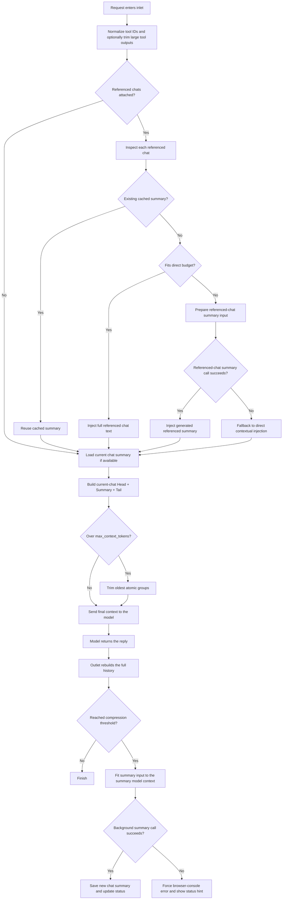

# Async Context Compression Filter

| By [Fu-Jie](https://github.com/Fu-Jie) · v1.6.2 | [⭐ Star this repo](https://github.com/Fu-Jie/openwebui-extensions) |
| :--- | ---: |

|  |  |  |  |  |  |  |
| :---: | :---: | :---: | :---: | :---: | :---: | :---: |

This filter reduces token consumption in long conversations through intelligent summarization and message compression while keeping conversations coherent.

## Install with Batch Install Plugins

If you already use [Batch Install Plugins from GitHub](https://openwebui.com/posts/batch_install_plugins_install_popular_plugins_in_s_c9fd6e80) , you can install or update this plugin with:

```text
Install plugin from Fu-Jie/openwebui-extensions
```

When the selection dialog opens, search for this plugin, check it, and continue.

> [!IMPORTANT]
> If the official OpenWebUI Community version is already installed, remove it first. After that, Batch Install Plugins can keep this plugin updated in future runs.

## What's new in 1.6.1

- **Open WebUI 0.9.x compatibility**: Added adaptive OpenWebUI version detection for async DB APIs.
- **Async DB fix**: `Chats.get_chat_by_id` now uses the correct async/sync call path based on Open WebUI version.
- **Async session helpers**: Added `_call_db` and `_call_db_sync` helpers to bridge sync/async DB method calls across versions.

## What's new in 1.6.0

- **Fixed `keep_first` Logic**: Re-defined `keep_first` to protect the first N **non-system** messages plus all interleaved system messages. This ensures initial context (e.g., identity, task instructions) is preserved correctly.
- **Absolute System Message Protection**: System messages are now strictly excluded from compression. Any system message encountered in the history (even late-injected ones) is preserved as an original message in the final context.
- **Improved Context Assembly**: Summaries now only target User and Assistant dialogue, ensuring that system instructions injected by other plugins are never "eaten" by the summarizer.

## What's new in 1.5.0

- **External Chat Reference Summaries**: Added support for referenced chat context blocks that can reuse cached summaries, inject small referenced chats directly, or generate summaries for larger referenced chats before injection.
- **Fast Multilingual Token Estimation**: Added a new mixed-script token estimation pipeline so inlet/outlet preflight checks can avoid unnecessary exact token counts while staying much closer to real usage.
- **Stronger Working-Memory Prompt**: Refined the XML summary prompt to better preserve actionable context across general chat, coding tasks, and tool-heavy conversations.
- **Clearer Frontend Debug Logs**: Reworked browser-console logging into grouped structural snapshots that are easier to scan during debugging.
- **Safer Tool Trimming Defaults**: Enabled native tool-output trimming by default and exposed a dedicated `tool_trim_threshold_chars` valve with a 600-character default.
- **Safer Referenced-Chat Fallbacks**: If generating a referenced chat summary fails, the new reference-summary path now falls back to direct contextual injection instead of failing the whole chat.
- **Correct Summary Budgeting**: `summary_model_max_context` now controls summary-input fitting, while `max_summary_tokens` remains an output-length cap.
- **More Visible Summary Failures**: Important background summary failures now surface in the browser console (`F12`) and as a status hint even when `show_debug_log` is off.

---

## Core Features

- ✅ **Full i18n Support**: Native localization across 9 languages.
- ✅ Automatic compression triggered by token thresholds.
- ✅ Asynchronous summarization that does not block chat responses.
- ✅ Persistent storage via Open WebUI's shared database connection (PostgreSQL, SQLite, etc.).
- ✅ Flexible retention policy to keep the first and last N messages.
- ✅ Smart injection of historical summaries back into the context.
- ✅ External chat reference summarization with cached-summary reuse, direct injection for small chats, and generated summaries for larger chats.
- ✅ Structure-aware trimming that preserves document structure (headers, intro, conclusion).
- ✅ Native tool output trimming for cleaner context when using function calling.
- ✅ Real-time context usage monitoring with warning notifications (>90%).
- ✅ Fast multilingual token estimation plus exact token fallback for precise debugging and optimization.
- ✅ **Smart Model Matching**: Automatically inherits configuration from base models for custom presets.
- ⚠ **Multimodal Support**: Images are preserved but their tokens are **NOT** calculated. Please adjust thresholds accordingly.

---

## What This Fixes

- **Problem: System Messages being summarized/lost.**
  Previously, the filter could include system messages (especially those injected late by other plugins) in its summarization zone, causing important instructions to be lost. Now, all system messages are strictly preserved in their original role and never summarized.
- **Problem: Incorrect `keep_first` behavior.**
  Previously, `keep_first` simply took the first $N$ messages. If those were only system messages, the initial user/assistant messages (which are often important for context) would be summarized. Now, `keep_first` ensures that $N$ non-system messages are protected.
- **Problem 1: A referenced chat could break the current request.**
  Before, if the filter needed to summarize a referenced chat and that LLM call failed, the current chat could fail with it. Now it degrades gracefully and injects direct context instead.
- **Problem 2: Some referenced chats were being cut too aggressively.**
  Before, the output limit (`max_summary_tokens`) could be treated like the input window, which made large referenced chats shrink earlier than necessary. Now input fitting uses the summary model's real context window (`summary_model_max_context` or model/global fallback).
- **Problem 3: Some background summary failures were too easy to miss.**
  Before, a failure during background summary preparation could disappear quietly when frontend debug logging was off. Now important failures are forced to the browser console and also shown through a user-facing status message.

---

## Workflow Overview

This filter operates in two phases:

1. `inlet`: injects stored summaries, processes external chat references, and trims context when required before the request is sent to the model.
2. `outlet`: runs asynchronously after the response is complete, decides whether a new summary should be generated, and persists it when appropriate.



### Key Notes

- `inlet` only injects and trims context. It does not generate the main chat summary.
- `outlet` performs summary generation asynchronously and does not block the current reply.
- External chat references may come from an existing persisted summary, a small chat's full text, or a generated/truncated reference summary.
- If a referenced-chat summary call fails, the filter falls back to direct context injection instead of failing the whole request.
- `summary_model_max_context` controls summary-input fitting. `max_summary_tokens` only controls how long the generated summary may be.
- Important background summary failures are surfaced to the browser console (`F12`) and the chat status area.
- External reference messages are protected during trimming so they are not discarded first.

---

## Installation & Configuration

### 1) Database (automatic)

- Uses Open WebUI's shared database connection; no extra configuration needed.
- The `chat_summary` table is created on first run.

### 2) Filter order

- Recommended order: pre-filters (<10) → this filter (10) → post-filters (>10).

---

## Configuration Parameters

| Parameter                      | Default  | Description                                                                                                                                                           |
| :----------------------------- | :------- | :-------------------------------------------------------------------------------------------------------------------------------------------------------------------- |
| `priority`                     | `10`     | Execution order; lower runs earlier.                                                                                                                                  |
| `compression_threshold_tokens` | `64000`  | Trigger asynchronous summary when total tokens exceed this value. Set to 50%-70% of your model's context window.                                                      |
| `max_context_tokens`           | `128000` | Hard cap for context; older messages (except protected ones) are dropped if exceeded.                                                                                 |
| `keep_first`                   | `1`      | Number of initial **non-system** messages to always keep (plus all preceding system prompts).                                                                         |
| `keep_last`                    | `6`      | Always keep the last N messages to preserve recent context.                                                                                                           |
| `summary_model`                | `None`   | Model for summaries. Strongly recommended to set a fast, economical model (e.g., `gemini-2.5-flash`, `deepseek-v3`). Falls back to the current chat model when empty. |
| `summary_model_max_context`    | `0`      | Input context window used to fit summary requests. If `0`, falls back to `model_thresholds` or global `max_context_tokens`.                                          |
| `max_summary_tokens`           | `16384`  | Maximum output length for the generated summary. This is not the summary-input context limit.                                                                         |
| `summary_temperature`          | `0.1`    | Randomness for summary generation. Lower is more deterministic.                                                                                                       |
| `model_thresholds`             | `{}`     | Per-model overrides for `compression_threshold_tokens` and `max_context_tokens` (useful for mixed models).                                                            |
| `enable_tool_output_trimming`  | `true`   | When enabled for `function_calling: "native"`, trims oversized native tool outputs while keeping the tool-call chain intact.                                          |
| `tool_trim_threshold_chars`     | `600`    | Trim native tool output blocks once their total content length reaches this threshold.                                                                                 |
| `debug_mode`                   | `false`  | Log verbose debug info. Set to `false` in production.                                                                                                                 |
| `show_debug_log`               | `false`  | Print debug logs to browser console (F12). Useful for frontend debugging.                                                                                             |
| `show_token_usage_status`      | `true`   | Show token usage status notification in the chat interface.                                                                                                           |
| `token_usage_status_threshold` | `80`     | The minimum usage percentage (0-100) required to show a context usage status notification.                                                                            |

---

## ⭐ Support

If this plugin has been useful, a star on [OpenWebUI Extensions](https://github.com/Fu-Jie/openwebui-extensions) is a big motivation for me. Thank you for the support.

## Troubleshooting ❓

- **Initial system prompt is lost**: Keep `keep_first` greater than 0 to protect the initial message.
- **Compression effect is weak**: Raise `compression_threshold_tokens` or lower `keep_first` / `keep_last` to allow more aggressive compression.
- **A referenced chat summary fails**: The current request should continue with a direct-context fallback. Check the browser console (`F12`) if you need the upstream failure details.
- **A background summary silently seems to do nothing**: Important failures now surface in chat status and the browser console (`F12`).
- **Submit an Issue**: If you encounter any problems, please submit an issue on GitHub: [OpenWebUI Extensions Issues](https://github.com/Fu-Jie/openwebui-extensions/issues)

## Changelog

See [`v1.5.0` Release Notes](https://github.com/Fu-Jie/openwebui-extensions/blob/main/plugins/filters/async-context-compression/v1.5.0.md) for the release-specific summary.

See the full history on GitHub: [OpenWebUI Extensions](https://github.com/Fu-Jie/openwebui-extensions)
