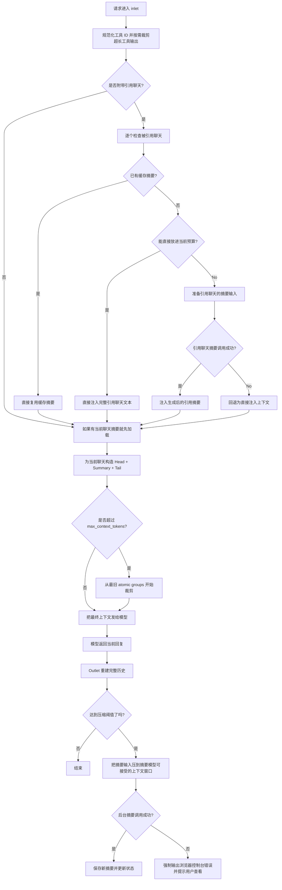

# 异步上下文压缩过滤器

| 作者：[Fu-Jie](https://github.com/Fu-Jie) · v1.6.1 | [⭐ 点个 Star 支持项目](https://github.com/Fu-Jie/openwebui-extensions) |
| :--- | ---: |

|  |  |  |  |  |  |  |
| :---: | :---: | :---: | :---: | :---: | :---: | :---: |

> **重要提示**：为了确保所有过滤器的可维护性和易用性，每个过滤器都应附带清晰、完整的文档，以确保其功能、配置和使用方法得到充分说明。

本过滤器通过智能摘要和消息压缩技术，在保持对话连贯性的同时，显著降低长对话的 Token 消耗。

## 使用 Batch Install Plugins 安装

如果你已经安装了 [Batch Install Plugins from GitHub](https://openwebui.com/posts/batch_install_plugins_install_popular_plugins_in_s_c9fd6e80) ，可以用下面这句来安装或更新当前插件：

```text
从 Fu-Jie/openwebui-extensions 安装插件
```

当选择弹窗打开后，搜索当前插件，勾选后继续安装即可。

> [!IMPORTANT]
> 如果你已经安装了 OpenWebUI 官方社区里的同名版本，请先删除旧版本，否则重新安装时可能报错。删除后，Batch Install Plugins 后续就可以继续负责更新这个插件。
## 1.6.1 版本更新

- **兼容 Open WebUI 0.9.x**：新增 OpenWebUI 版本检测，适配异步数据库调用接口变化。
- **异步数据库修复**：`Chats.get_chat_by_id` 现在根据 Open WebUI 版本选择正确的 async / sync 路径。
- **异步会话助手**：新增 `_call_db` 和 `_call_db_sync` 辅助函数，弥合不同版本间 sync/async DB 方法调用的差异。
## 1.6.0 版本更新

- **修正 `keep_first` 逻辑**：重新定义了 `keep_first` 的功能，现在它负责保护前 N 条**非系统消息**（以及它们之前的所有系统提示词）。这确保了初始对话背景（如身份设定、任务说明）能被正确保留。
- **系统消息绝对保护**：系统消息现在被严格排除在压缩范围之外。历史记录中遇到的任何系统消息（甚至是后期注入的消息）都会作为原始消息保留在最终上下文中。
- **改进的上下文组装**：摘要现在仅针对用户和助手的对话，确保其他插件注入的系统指令永远不会被摘要器“吃掉”。

## 1.5.0 版本更新

- **外部聊天引用摘要**: 新增对引用聊天上下文的摘要支持。现在可以复用缓存摘要、直接注入较小引用聊天，或先为较大的引用聊天生成摘要再注入。
- **快速多语言 Token 预估**: 新增混合脚本 Token 预估链路，使 inlet / outlet 的预检可以减少不必要的精确计数，同时比旧的粗略字符比值更接近真实用量。
- **更稳健的工作记忆提示词**: 重写 XML 摘要提示词，增强普通聊天、编码任务和连续工具调用场景下的关键信息保留能力。
- **更清晰的前端调试日志**: 浏览器控制台日志改为分组化、结构化展示，排查上下文压缩行为更直观。
- **更安全的工具裁剪默认值**: 原生工具输出裁剪默认开启，并新增 `tool_trim_threshold_chars` 配置项，默认阈值为 600 字符。
- **更稳妥的引用聊天回退**: 当新的引用聊天摘要路径生成失败时，不再拖垮当前请求，而是自动回退为直接注入上下文。
- **更准确的摘要预算**: `summary_model_max_context` 现在只负责摘要输入窗口，`max_summary_tokens` 继续只负责摘要输出长度。
- **更容易发现摘要失败**: 重要的后台摘要失败现在会强制显示到浏览器控制台 (`F12`)，并同步给出状态提示。

---

## 核心特性

- ✅ **全方位国际化**: 原生支持 9 种界面语言。
- ✅ **自动压缩**: 基于 Token 阈值自动触发上下文压缩。
- ✅ **异步摘要**: 后台生成摘要，不阻塞当前对话响应。
- ✅ **持久化存储**: 复用 Open WebUI 共享数据库连接，自动支持 PostgreSQL/SQLite 等。
- ✅ **灵活保留策略**: 可配置保留对话头部和尾部消息，确保关键信息连贯。
- ✅ **智能注入**: 将历史摘要智能注入到新上下文中。
- ✅ **外部聊天引用摘要**: 支持复用缓存摘要、小聊天直接注入，以及大聊天先摘要后注入。
- ✅ **结构感知裁剪**: 智能折叠过长消息，保留文档骨架（标题、首尾）。
- ✅ **原生工具输出裁剪**: 支持裁剪冗长的工具调用输出。
- ✅ **实时监控**: 实时监控上下文使用情况，超过 90% 发出警告。
- ✅ **快速预估 + 精确回退**: 提供更快的多语言 Token 预估，并在必要时回退到精确统计，便于调试。
- ✅ **智能模型匹配**: 自定义模型自动继承基础模型的阈值配置。
- ⚠ **多模态支持**: 图片内容会被保留，但其 Token **不参与计算**。请相应调整阈值。

---

## 这次解决了什么问题（通俗版）

- **问题：系统消息被摘要或丢失。**
  以前，过滤器可能会将被引用或后期注入的系统消息包含在摘要区域内，导致重要的指令丢失。现在，所有系统消息都严格按原样保留，永不被摘要。
- **问题：`keep_first` 逻辑不符合预期。**
  以前 `keep_first` 只是简单提取前 N 条消息。如果前几条全是系统消息，初始的问答（通常对上下文很重要）就会被压缩掉。现在 `keep_first` 确保保护 N 条非系统消息。
- **问题 1：引用别的聊天时，摘要失败可能把当前对话一起弄挂。**
  以前如果过滤器需要先帮被引用聊天做摘要，而这一步的 LLM 调用失败了，当前请求也可能直接失败。现在改成了“能摘要就摘要，失败就退回直接塞上下文”，当前对话不会被一起拖死。
- **问题 2：有些被引用聊天被截得太早，信息丢得太多。**
  以前有一段逻辑把 `max_summary_tokens` 这种“输出长度限制”误当成了“输入上下文窗口”，结果大一点的引用聊天会被过早截断。现在改成按摘要模型真实的输入窗口来算，能保留更多有用内容。
- **问题 3：后台摘要失败时，用户不容易知道发生了什么。**
  以前在 `show_debug_log=false` 时，有些后台失败只会留在内部日志里。现在关键失败会强制打到浏览器控制台，并在聊天状态里提醒去看 `F12`。

---

## 工作流总览

该过滤器分为两个阶段：

1. `inlet`：在请求发送给模型前执行，负责注入已有摘要、处理外部聊天引用、并在必要时裁剪上下文。
2. `outlet`：在模型回复完成后异步执行，负责判断是否需要生成新摘要，并在合适时写入数据库。



### 关键说明

- `inlet` 只负责注入和裁剪上下文，不负责生成当前聊天的主摘要。
- `outlet` 异步生成摘要，不会阻塞当前回复。
- 外部聊天引用可以来自已有持久化摘要、小聊天的完整文本，或动态生成/截断后的引用摘要。
- 如果引用聊天摘要失败，会自动回退为直接注入上下文，而不是让当前请求失败。
- `summary_model_max_context` 控制摘要输入窗口；`max_summary_tokens` 只控制生成摘要的输出长度。
- 重要的后台摘要失败会显示到浏览器控制台 (`F12`) 和聊天状态提示里。
- 外部引用消息在裁剪阶段会被特殊保护，避免被最先删除。

---

## 安装与配置

### 1. 数据库（自动）

- 自动使用 Open WebUI 的共享数据库连接，**无需额外配置**。
- 首次运行自动创建 `chat_summary` 表。

### 2. 过滤器顺序

- 建议顺序：前置过滤器（<10）→ 本过滤器（10）→ 后置过滤器（>10）。

---

## 配置参数

您可以在过滤器的设置中调整以下参数：

### 核心参数

| 参数                           | 默认值   | 描述                                                                                  |
| :----------------------------- | :------- | :------------------------------------------------------------------------------------ |
| `priority`                     | `10`     | 过滤器执行顺序，数值越小越先执行。                                                    |
| `compression_threshold_tokens` | `64000`  | **重要**: 当上下文总 Token 超过此值时后台生成摘要，建议设为模型上下文窗口的 50%-70%。 |
| `max_context_tokens`           | `128000` | **重要**: 上下文硬上限，超过即移除最早消息（保留受保护消息）。                        |
| `keep_first`                   | `1`      | 始终保留对话开始的 N 条**非系统消息**（以及它们之前的所有系统提示词）。               |
| `keep_last`                    | `6`      | 始终保留对话末尾的 N 条消息，确保最近上下文连贯。                                     |

### 摘要生成配置

| 参数                  | 默认值  | 描述                                                                                                                                        |
| :-------------------- | :------ | :------------------------------------------------------------------------------------------------------------------------------------------ |
| `summary_model`       | `None`  | 用于生成摘要的模型 ID。**强烈建议**配置快速、经济、上下文窗口大的模型（如 `gemini-2.5-flash`、`deepseek-v3`）。留空则尝试复用当前对话模型。 |
| `summary_model_max_context` | `0`     | 摘要请求可使用的输入上下文窗口。如果为 0，则回退到 `model_thresholds` 或全局 `max_context_tokens`。                                          |
| `max_summary_tokens`  | `16384` | 生成摘要时允许的最大输出 Token 数。它不是摘要输入窗口上限。                                                                                 |
| `summary_temperature` | `0.1`   | 控制摘要生成的随机性，较低的值结果更稳定。                                                                                                  |

### 高级配置

#### `model_thresholds` (模型特定阈值)

这是一个字典配置，可为特定模型 ID 覆盖全局 `compression_threshold_tokens` 与 `max_context_tokens`，适用于混合不同上下文窗口的模型。

**默认包含 GPT-4、Claude 3.5、Gemini 1.5/2.0、Qwen 2.5/3、DeepSeek V3 等推荐阈值。**

**配置示例：**

```json
{
  "gpt-4": {
    "compression_threshold_tokens": 8000,
    "max_context_tokens": 32000
  },
  "gemini-2.5-flash": {
    "compression_threshold_tokens": 734000,
    "max_context_tokens": 1048576
  }
}
```

| 参数                           | 默认值   | 描述                                                                                                                                    |
| :----------------------------- | :------- | :-------------------------------------------------------------------------------------------------------------------------------------- |
| `enable_tool_output_trimming`  | `true`   | 启用后（仅在 `function_calling: "native"` 下生效）会裁剪过大的本机工具输出，保留工具调用链结构并以简短占位替换冗长内容。             |
| `tool_trim_threshold_chars`     | `600`    | 当本机工具输出累计字符数达到该值时触发裁剪，适用于包含长文本或表格的工具结果。                                                           |
| `debug_mode`                   | `false`   | 是否在 Open WebUI 的控制台日志中打印详细的调试信息。生产环境默认且建议设为 `false`。 |
| `show_debug_log`               | `false`  | 是否在浏览器控制台 (F12) 打印调试日志。便于前端调试。                                                                   |
| `show_token_usage_status`      | `true`   | 是否在对话结束时显示 Token 使用情况的状态通知。                                                                         |
| `token_usage_status_threshold` | `80`     | 触发显示上下文用量状态通知的最低百分比阈值 (0-100)。                                                                    |

---

## ⭐ 支持

如果这个插件对你有帮助，欢迎到 [OpenWebUI Extensions](https://github.com/Fu-Jie/openwebui-extensions) 点个 Star，这将是我持续改进的动力，感谢支持。

## 故障排除 (Troubleshooting) ❓

- **初始系统提示丢失**：将 `keep_first` 设置为大于 0。
- **压缩效果不明显**：提高 `compression_threshold_tokens`，或降低 `keep_first` / `keep_last` 以增强压缩力度。
- **引用聊天摘要失败**：当前请求现在应该会继续执行，并回退为直接注入上下文。如果要看上游失败原因，请打开浏览器控制台 (`F12`)。
- **后台摘要看起来“没反应”**：重要失败现在会同时出现在状态提示和浏览器控制台 (`F12`) 中。
- **提交 Issue**: 如果遇到任何问题，请在 GitHub 上提交 Issue：[OpenWebUI Extensions Issues](https://github.com/Fu-Jie/openwebui-extensions/issues)

## 更新日志

请查看 [`v1.5.0` 版本发布说明](https://github.com/Fu-Jie/openwebui-extensions/blob/main/plugins/filters/async-context-compression/v1.5.0_CN.md) 获取本次版本的独立发布摘要。

完整历史请查看 GitHub 项目： [OpenWebUI Extensions](https://github.com/Fu-Jie/openwebui-extensions)
