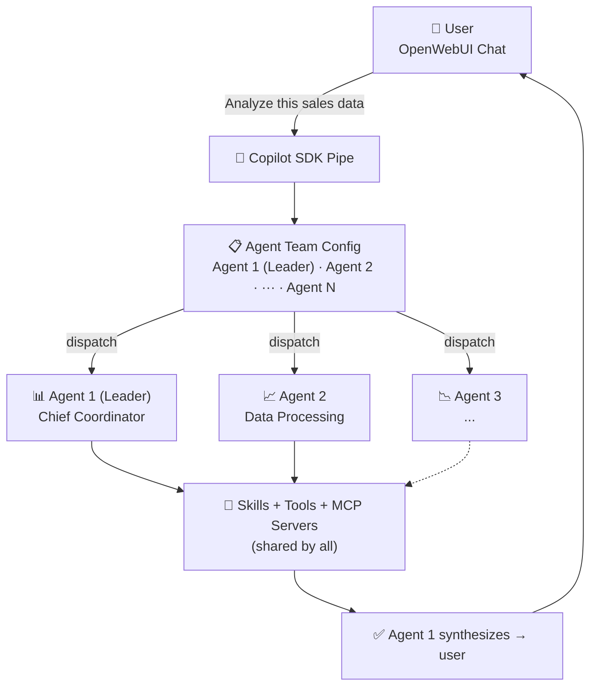

# GitHub Copilot SDK Pipe v0.13.0 — Agent Team + Autopilot/Plan Mode Switching

Hey there, OpenWebUI community! 👋

I'm excited to share **v0.13.0** of the GitHub Copilot SDK Pipe — the biggest release since the plugin launched, with two capabilities that meaningfully change what it can do.

---

## 🤖 What's New: Agent Team

For the first time, you can configure a **team of OpenWebUI custom models** to work together as sub-agents in a single Copilot SDK session.

How it works:
- **Dynamic tag loading** (`AGENT_TEAM_TAG`) — the valve automatically lists all tags from your OpenWebUI custom models, so you pick from a dropdown instead of typing manually
- **Leader selection** (`AGENT_TEAM_LEADER`) — pick which agent coordinates the team
- **Model ID fallback** (`AGENT_TEAM_MODEL_IDS`) — if you skip the tag approach, manually enter a comma-separated list of custom model IDs instead
- **Tool inheritance** — every agent gets the same OpenWebUI skills and MCP servers as the base session
- Works at both global (Valves) and per-user (User Valves) level

**Key design**: Each agent is defined by its OpenWebUI **system prompt** (`params.system` / `meta.system_prompt`) — the base model ID is never used. The Copilot SDK reads the system prompt and registers it as a sub-agent. No extra configuration needed beyond what you already have in OpenWebUI.

For example: a data analysis team, configured in OpenWebUI as three custom models:
- **Agent 1** (OpenWebUI Model A): system prompt = "You are the chief data analyst, coordinating the team's work"
- **Agent 2** (OpenWebUI Model B): system prompt = "You specialize in data processing and statistical analysis, expert at handling large datasets with Python/pandas"
- **Agent 3** (OpenWebUI Model C): system prompt = "You specialize in data visualization and report generation, skilled at creating charts and writing analysis conclusions"

When you say "analyze this sales data", Agent 1 recognizes this requires parallel multi-dimensional work and **dispatches data processing and visualization to Agent 2 and other agents simultaneously**. All agents work in parallel, and Agent 1 synthesizes their findings into a complete analysis report returned to you.

All agents share the same OpenWebUI Skills and MCP server tools; which actual models are called is decided by the Copilot SDK based on the system prompts.

---

## 🎯 What's New: Autopilot / Plan Mode Switching

v0.13.0 introduces full **Session Mode** support, giving you control over the Agent's working rhythm. A mode-specific **`[Active Session Mode]`** block is injected into the system prompt, aligned with the official [Copilot SDK agent-loop docs](https://github.com/github/copilot-sdk/blob/main/docs/features/agent-loop.md):

- **`autopilot`**: Agent drives tasks end-to-end, never pauses to ask "shall I proceed?" — the SDK sends a continuation nudge if `task_complete` is not called
- **`interactive`**: Agent completes your request and stops — no chaining, no autonomous continuation
- **`plan`**: Agent researches and presents a structured plan first, waits for your approval before writing a single file (but respects "just do it" overrides)
- SDK-level `mode.set()` is also hardened with `asyncio.wait_for(timeout=5.0)` on both resume and create paths

The default is `autopilot`, which is what most people want: describe a task, let the agent run it to completion.

---

## 🔧 Other Fixes

- **System Prompt Overhaul**: Removed hardcoded Copilot CLI tool names and inapplicable conventions; resolved a SQL pattern contradiction between task tracking (`todos`) and Rich UI state (`interactive_controls`)
- **SESSION_MODE Priority**: Now resolved once globally as user_valve → global valve → `"autopilot"` — clean and consistent

---

## 📥 Install / Update

> If you have the OpenWebUI Community version installed, remove it first, then install from this repo.

**Batch Install (recommended)**: [openwebui-extensions Batch Install Guide](https://github.com/Fu-Jie/openwebui-extensions/blob/main/scripts/DEPLOYMENT_GUIDE.md)

**Manual**: Install from the [OpenWebUI Plugin Marketplace](https://openwebui.com/posts/github_copilot_official_sdk_pipe_ce96f7b4).

**Full changelog**: [v0.13.0 Release Notes](https://github.com/Fu-Jie/openwebui-extensions/blob/main/plugins/pipes/github-copilot-sdk/v0.13.0.md)
