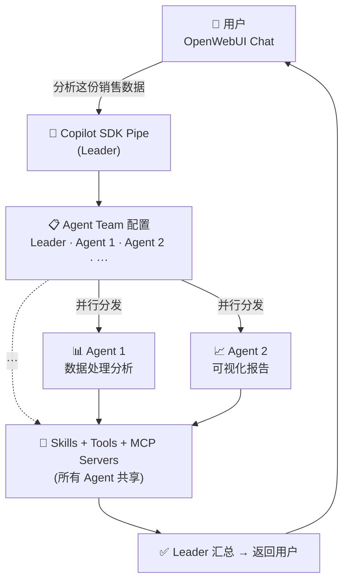

# GitHub Copilot SDK Pipe v0.13.0 — Agent Team 多智能体 + Session Mode 全链路生效

大家好 👋

**v0.13.0** 是 GitHub Copilot SDK Pipe 自发布以来最重要的一次更新，带来了两项真正改变插件能做什么的核心能力。

---

## 🤖 新功能：Agent Team 多智能体协作

现在可以将一组 **OpenWebUI 自定义模型**配置为子 Agent 团队，在单次 Copilot SDK 会话中协同工作。

使用方式：
- **按标签选择 Agent**（`AGENT_TEAM_TAG`）：在 OpenWebUI 中给一组模型打上标签，Pipe 自动发现；或者**直接指定模型 ID**（`AGENT_TEAM_MODEL_IDS`）
- **指定领队**（`AGENT_TEAM_LEADER`）：领队 Agent 负责统筹协调
- **工具能力自动继承**：每个 Agent 自动获得与主会话相同的 OpenWebUI Skills 和 MCP 服务器，整个团队能力一致
- 支持全局（Valves）和按用户（User Valves）两级配置

比如：一个数据分析团队，在 OpenWebUI 中配置三个自定义模型：
- **Leader**（OpenWebUI 模型 A）：系统提示词 = "你是一个首席数据分析师，统筹协调团队工作"
- **Agent 1**（OpenWebUI 模型 B）：系统提示词 = "你专注于数据处理和统计分析，擅长用 Python/pandas 处理海量数据"
- **Agent 2**（OpenWebUI 模型 C）：系统提示词 = "你专注于数据可视化和报告生成，擅长制作图表和撰写分析结论"

用户说"分析这份销售数据"，Leader 识别出这是一个需要并行的多维度任务，将数据处理和可视化**同时**分发给 Agent 1 和 Agent 2 并行执行，最后汇总成一份完整的分析报告返回给用户。

所有 Agent 共享相同的 OpenWebUI Skills 和 MCP 服务器工具集；具体调用哪个模型由 Copilot SDK 根据系统提示词自行选择。

---

## 🎯 新功能：Session Mode

v0.13.0 引入了完整的 **Session Mode** 支持，可以控制 Agent 的工作节奏。一个模式专属的 **`[Active Session Mode]`** 指令块会被注入到系统提示词中，语言与官方 [Copilot SDK agent-loop 文档](https://github.com/github/copilot-sdk/blob/main/docs/features/agent-loop.md) 对齐：

- **`autopilot`**：Agent 端到端驱动任务，绝不中途停下来问"要继续吗？"——如果未调用 `task_complete`，SDK 会发送续行 nudge 继续推进
- **`interactive`**：Agent 完成当前请求后停止，不会自主串联下一步
- **`plan`**：Agent 先研究并输出结构化方案，等待你明确批准后再动任何文件（但如果你说"直接做"，它会听）
- SDK 级别的 `mode.set()` 也加入了 `asyncio.wait_for(timeout=5.0)` 防卡死保护

默认值是 `autopilot`——大部分人想要的：描述任务，让 Agent 跑完。

---

## 🔧 其他修复

- **系统提示词全面清理**：移除硬编码的 Copilot CLI 工具名和不适用约定；解决了任务跟踪（`todos`）与 Rich UI 状态（`interactive_controls`）之间的 SQL 模式矛盾
- **SESSION_MODE 优先级统一**：现在在入口处统一解析为 user_valve → global valve → `"autopilot"`，逻辑清晰

---

## 📥 安装 / 更新

> 如果已安装了 OpenWebUI 官方社区的同名版本，请先删除，再安装本仓库版本。

**批量安装（推荐）**：[openwebui-extensions 批量安装指南](https://github.com/Fu-Jie/openwebui-extensions/blob/main/scripts/DEPLOYMENT_GUIDE.md)

**手动安装**：从 [OpenWebUI 插件市场](https://openwebui.com/posts/github_copilot_official_sdk_pipe_ce96f7b4) 安装。

**完整更新日志**：[v0.13.0 Release Notes](https://github.com/Fu-Jie/openwebui-extensions/blob/main/plugins/pipes/github-copilot-sdk/v0.13.0.md)
